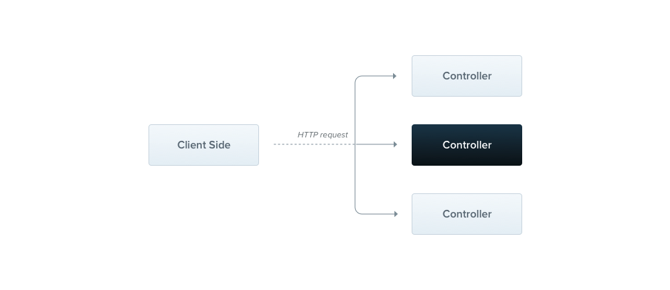

# Controllers

컨트롤러(Controller)는 들어오는 요청을 처리하는 것과 클라이언트에 응답을 반환하는 역할을 한다.



컨트롤러의 목적은 어플리케이션에 들어오는 요청을 받는 것이다. **라우팅(Routing)** 메커니즘은 어떤 컨트롤러가 요청을 받을지 제어한다. 대부분 각 컨트롤러는 하나 이상의 라우트(Route)를 가지고 각 라우트는 각자 다른 역할을 수행한다.

Nest는 기본 컨트롤러를 만들기 위해 클래스(Class)와 **데코레이터(Decorater)** 를 사용한다. 데코레이터는 클래스와 필요한 메타 데이터를 연관 짓고 Nest가 라우팅 맵(Routing map)을 생성할 수 있도록 한다.

> **힌트
> validation**이 내장된 CRUD 컨트롤러를 빠르게 만들고 싶을땐 CLI의 CRUD 제네레이터를 사용할 수 있다: `nest g resource [name]`.

### 라우팅(Routing)

다음 예제는 `@Controller` 데코레이터를 사용하는데, 컨트롤러 정의 시 반드시 필요하다. 그리고 라우트 경로 접두사를 `cats` 라고 명시했다. `@Controller` 데코레이터 안에 라우트 경로 접두사를 적어 관련된 라우트를 쉽게 그룹 짓고 반복되는 코드를 줄일 수 있다. 예를 들어, 고객 엔티티와 상호작용을 관리하는 라우트 집합은 `/customers` 라우트 안에 그룹 지을 수 있다. 이런 경우, `@Controller` 안에 `customers` 라고 명시한다면 각 라우트 파일에 경로를 반복해서 적지 않아도 된다.

```tsx
import { Controller, Get } from "@nestjs/common";

@Controller("cats")
export class CatsController {
  @Get()
  findAll(): string {
    return "This action returns all cats";
  }
}
```

> **힌트**
> CLI를 이용해 컨트롤러를 생성하고 싶으면, `$ nest g controller cats` 라고 실행하면 된다.

`findAll()` 전의 `@Get()` HTTP 요청 메소드(HTTP Request method) 데코레이터는 Nest가 특정 HTTP 요청에 대한 엔드포인트(Endpoint)의 핸들러(Handler)를 만들도록 한다. 이 엔드포인트는 HTTP 요청 메소드(이번 경우, GET) 및 라우트 경로(Route path)와 상응한다. 라우트 경로란 무엇인가? 핸들러의 라우트 경로는 컨트롤러에 선언된 접두사와 메소드 데코레이터의 경로를 이은 것이다. 모든 라우트의 접두사를 `cats` 라고 선언하고, 메소드 데코레이터에는 경로를 명시하지 않았기 때문에 Nest는 `GET /cats` 를 해당 핸들러에 맵핑한다. 언급한 바와 같이, 라우트 경로는 컨트롤러의 접두사와 **그리고** 요청 메소드의 데코레이터에 선언된 경로 둘 다를 포함한다. 예를 들어, `customers` 의 경로 접두사와 데코레이터 `@Get(’profile’)` 가 결합하면 `GET /customers/profile` 에 대한 라우트 맵핑을 만든다.

위 예시와 같이, GET 요청이 이 엔드포인트에 오면 Nest는 그 요청을 `findAll()` 메소드에 라우팅한다. 이때 메소드 이름은 완전히 임의로 만든 것이다. 반드시 라우트에 바인딩할 메소드를 선언해야 하지만, Nest는 메소드의 이름에 의미를 부여하지 않는다.

이 메소드는 상태 코드 200과 관련된 응답을 반환할 것이다. 왜 이러한 일이 발생하는 것일까? 이를 알기 위해선 Nest의 **서로 다른** 두 가지 응답 조작 옵션에 대해 알아야 한다.

| 방식             | 설명                                                                                                                                                                                                                                                                                                                                                                                                                                |
| ---------------- | ----------------------------------------------------------------------------------------------------------------------------------------------------------------------------------------------------------------------------------------------------------------------------------------------------------------------------------------------------------------------------------------------------------------------------------- |
| Standard(추천)   | 이 내장 메소드를 사용하면, 요청 핸들러가 JavaScript 객체나 배열을 반환할 때 자동으로 JSON으로 변환해준다. 그러나 핸들러가 JavaScript 원시 타입을 반환한다면(예를 들어, string, number, boolean) Nest는 JSON으로 변환하지 않는다. 이는 응답 핸들링을 쉽게 만들어준다. 더 나아가, 응답 상태 코드는 201을 사용하는 POST 요청을 제외한 항상 기본적으로 200이다. 이는 핸들러에서 `@HttpCode(…)` 데코레이터를 사용해 쉽게 변경할 수 있다. |
| Library-specific | 메소드 핸들러 시그니쳐에서 @Res 데코레이터를 사용한다면(예를 들어, `findAll(@Res() response`) Library-specific한 응답 객체를 주입해 사용할 수 있다.                                                                                                                                                                                                                                                                                 |

> **주의**
> Nest는 핸들러가 `@Res()` 또는 `@Next()` 를 사용하는 경우를 탐지하는데, 이는 사용자가 Library-specific 옵션을 선택한 것을 말한다. 이러한 경우 해당 라우트에 대해서 Standard 옵션은 **자동으로 비활성화** 되며 더 이상 예상대로 동작하지 않는다. 두 옵션을 동시에 사용하기 위해선`passthrough` 옵션을 다음과 같이 `true` 로 해야 한다. `@Res({ passthrough: true })`

### 요청 객체(Request object)

핸들러는 종종 클라이언트 **요청** 세부 사항에 대해 접근할 필요가 있다. Nest는 기반 플랫폼(기본적으로 Express)의 **요청 객체**에 대한 접근을 제공한다. 핸들러의 시그니쳐에 `@Req()` 데코레이터를 추가하면 Nest가 이를 주입해주기 때문에 우리가 요청 객체애 대해 접근할 수 있게 된다.

```tsx
import { Controller, Get, Req } from "@nestjs/common";
import { Request } from "express";

@Controller("cats")
export class CatsController {
  @Get()
  findAll(@Req() request: Request): string {
    return "This action returns all cats";
  }
}
```

> **힌트**
> `@types/express` 패키지를 설치하면 위 예제처럼 `request: Request` 와 같이 `express` 에 관한 타입을 명시할 수 있다.

요청 객체는 HTTP 요청을 나타내고 쿼리 스트링(Query string), 매개변수(Parameter), HTTP 헤더(Header), HTTP 바디(Body)에 관한 속성을 가진다.

| Nest                         | Library-specific                  |
| ---------------------------- | --------------------------------- |
| `@Request(), @Req()`         | `req`                             |
| `@Response(), @Res()` **\*** | `res`                             |
| `@Next()`                    | `next`                            |
| `@Session()`                 | `req.session`                     |
| `@Param(key?: string)`       | `req.params / req.params[key]`    |
| `@Body(key?: string)`        | `req.body / req.body[key]`        |
| `@Query(key?: string)`       | `req.query / req.query[key]`      |
| `@Headers(name?: string)`    | `req.headers / req.headers[name]` |
| `@Ip()`                      | `req.ip`                          |
| `@HostParam()`               | `req.hosts`                       |

**\*** 기반 HTTP 플랫폼 (**Express** 와 **Fastify**) 간의 타입 호환성을 위해, Nest는 `@Res()`와 `@Response()` 데코레이터를 제공한다. `@Res()`는 단순히 `@Response()`의 줄임말이다. 둘 다 기반 네이티브 플랫폼 `response` 객체에 직접 접근할 수 있도록 한다. 이들을 사용할 때, 기반 라이브러리를 위한 타입들(예: `@types/express`) 또한 임포트(Import)시키는 것이 좋다. 기억해야할 것은 메소드 핸들러에서 `@Res()` 또는 `@Response()`를 주입하면 Nest가 해당 핸들러에 한해서 **Library-specific** 모드로 된다는 것이다. 이러한 경우 개발자에게 응답을 관리해야할 책임이 있다. 즉 반드시 개발자가 직접 `response` 객체에 대한 호출(예: `res.json(…)` )등을 하면서 응답을 관리해야 한다. 그렇지 않는 경우 HTTP 서버는 중단될 수 있다.

### 응답(Resources)

일찍이, 우리는 고양이 리소스를 가져오는 엔드포인트를 정의했다 (**GET** 라우트). 우리는 또한 새로운 레코드를 만드는 엔드포인트를 제공하고 싶다. 이러한 경우, **POST** 핸들러를 만들면 된다.

```tsx
import { Controller, Get, Post } from "@nestjs/common";

@Controller("cats")
export class CatsController {
  @Post()
  create(): string {
    return "This action adds a new cat";
  }

  @Get()
  findAll(): string {
    return "This action returns all cats";
  }
}
```

이는 간단하다. Nest는 모든 표준 HTTP 메소드를 위한 데코레이터들을 제공한다: `@Get()`
, `@Post()`, `@Put()`, `@Delete()`, `@Patch()`, `@Options()`, 그리고 `@Head()`. 게다가, `@All()` 은 이들 모두를 핸들링하는 엔드 포인트를 정의한다.

### 라우트 와일드카드(Route wildcards)

패턴 기반 라우트도 지원된다. 예를 들어, 별표(\*)는 와일드카드로 사용되며 아무 문자 조합이나 올 수 있다.

```tsx
@Get('ab*cd')
findAll() {
  return 'This route uses a wildcard';
}
```

`‘ab*cd’` 라우트 경로는 `abcd`, `ab_cd`, `abecd` 등과 매칭된다. 문자 `?`, `+`, `*`, 그리고 `()` 도 라우트 경로에 사용될 수 있는데, 이들은 정규 표현식에 사용하는 문자로 해석된다. `-`과 `.`은 문자 그대로 해석된다.

### 상태 코드(Status code)

언급한 바대로, 응답 상태 코드는 POST 요청의 201을 제외하고 항상 기본적으로 200이다. 이는 핸들러 레벨에서 `@HttpCode(…)` 데코레이터를 추가해 쉽게 바꿀 수 있다.

```tsx
@Post()
@HttpCode(204)
create() {
  return 'This action adds a new cat';
}
```

> **힌트**
> `@nestjs/common` 패키지에서 `HttpCode`를 임포트하면 된다.

종종, 상태 코드는 정적이진 않지만 다양한 요인에 따라 달라질 수 있다. 이러한 경우, `@Res()` 를 사용해 주입한 Library-specific **응답** 객체를 사용할 수 있다. (또는, 에러의 경우, 예외를 던질 수 있다.)

### 헤더(Headers)

사용자 정의 응답 헤더를 만들고 싶다면 `@Header()` 데코레이터 또는 Library-specific 응답 객체를 사용하면 된다. (`res.header()`를 직접 호출하면 된다.)

```tsx
@Post()
@Header('Cache-Control', 'none')
create() {
  return 'This action adds a new cat';
}
```

> **힌트**
> `@nestjs/common` 패키지에서 `Header`를 임포트하면 된다.

### 리다이렉션(Redirection)

응답을 특정 URL로 리다이렉트 하고 싶다면 `@Redirect()` 데코레이터 또는 Library-specific 응답 객체를 사용하면 된다. (`res.redirect()`를 직접 호출하면 된다.)

`@Redirect()` 는 두 개의 인자를 가진다. `url` 과 `statusCode`로, 둘 다 옵셔널이다. `statusCoded`의 기본값은 `302(Found)`이다.

```tsx
@Get()
@Redirect('https://nestjs.com', 301)
```

때때로 HTTP 상태 코드나 리다이렉트 URL을 동적으로 결정하고 싶을때도 있을 것이다. 이는 라우트 핸들러 메소드에서 다음과 같은 모양의 객체를 반환하면 된다.

```tsx
{
  "url": string,
  "statusCode": number
}
```

반환된 값은 `@Redirect()` 데코레이터에 넘겨진 인자를 덮어 쓴다. 예를 들어:

```tsx
@Get('docs')
@Redirect('https://docs.nestjs.com', 302)
getDocs(@Query('version') version) {
  if (version && version === '5') {
    return { url: 'https://docs.nestjs.com/v5/' };
  }
}
```

### 라우트 매개변수(Route parameters)

경로가 정적인 라우트는 요청에서 동적 데이터를 얻을 수 없다 (예: 번호가 `1`인 고양이를 얻기 위한 `GET /cats/1`). 라우트에 매개변수를 정의하고 싶다면, 라우트 경로에 라우트 매개변수 **토큰**(Route parameter token)을 추가해 요청 URL에서 해당 위치에 있는 동적 데이터를 얻을 수 있다. 아래 예시와 같이 `@Get()` 데코레이터에 라우트 매개변수 토큰을 넣어 사용하면 된다. 이런 방식으로 정의된 라우트 매개변수는 `@Param()` 데코레이터를 사용해 접근할 수 있는데, 이는 메소드 시그니쳐에 추가되어야 한다.

```tsx
@Get(':id')
findOne(@Param() params): string {
  console.log(params.id);
  return `This action returns a #${params.id} cat`;
}
```

`@Param()` 은 메소드의 구현체 안에서 메소드 매개변수를 사용할 수 있도록 한다. 위 코드에서 봤듯이, `params.id` 를 통해 매개변수 `id` 에 접근할 수 있다. 만약 특정 매개변수 토큰을 전달한다면, 메소드 구현체에서 직접 라우트 매개변수의 이름으로 참조할 수 있다.

> **힌트**
> `@nestjs/common` 패키지에서 `Param`를 임포트하면 된다.

```tsx
@Get(':id')
findOne(@Param('id') id: string): string {
  return `This action returns a #${id} cat`;
}
```

### 서브-도메인 라우팅(Sub-Domain Routing)

`@Controller` 데코레이터는 `host` 옵션을 추가해 해당 요청의 HTTP 호스트가 특정 값과 매칭하도록 요구할 수 있다.

```tsx
@Controller({ host: "admin.example.com" })
export class AdminController {
  @Get()
  index(): string {
    return "Admin page";
  }
}
```

> **주의** > **Fastify**는 중첩 라우터에 대한 지원이 부족하기 때문에, 서브-도메인 라우팅을 할 때 Express 어댑터가 대신 사용되어야 한다.

라우트의 `path` 와 비슷하게, `host` 옵션은 토큰을 사용해 호스트 네임에서 해당 위치의 동적 데이터를 가져올 수 있다. `@Controller` 데코레이터의 호스트 매개변수 토큰은 다음과 같이 사용 가능하다. 이런 방식으로 정의된 호스트 매개변수는 `@HostParam()` 데코레이터를 사용해 접근할 수 있는데, 이는 메소드 시그니쳐에 추가되어야 한다.

```tsx
@Controller({ host: ":account.example.com" })
export class AccountController {
  @Get()
  getInfo(@HostParam("account") account: string) {
    return account;
  }
}
```

### 비동기성(Asynchronicity)

우리는 현대 JavaScript를 사랑하기 때문에 대부분의 데이터는 **비동기적으로** 교환되는 것을 안다. 이는 왜 Nest가 `async` 함수들을 지원하고 함수들과 잘 동작하는가에 대한 이유다.

모든 비동기 함수는 `Promise` 를 반환해야 한다. 이는 지연된 값(Deferred value)을 반환하면 Nest가 자체적으로 해결(Resolve)할 수 있다는 것이다. 다음 예시를 보아라:

```tsx
@Get()
async findAll(): Promise<any[]> {
  return [];
}
```

## 요청 페이로드(Request payloads)

이전의 POST 라우트 핸들러의 예시들은 클라이언트로부터 매개변수를 받지 않았다. `@Body` 데코레이터를 추가해 이를 해결해보자.

하지만 먼저, 우리는 **DTO**(Data Transfer Object) 스키마를 정의해야 한다. DTO는 객체로 어떻게 데이터가 네트워크 상에서 전송될 지를 정의한다. 우리는 DTO를 TypeScript의 인터페이스, 또는 클래스로 정의할 수 있다. 이때 클래스를 사용할 것을 추천한다. 왜냐하면, 클래스는 JavaScript ES6 표준이 지원하기 때문에 이들은 컴파일된 JavaScript에도 실제 엔티티로써 남아있기 때문이다. 반면 TypeScript 인터페이스는 컴파일 도중 제거되어 Nest가 런타임 도중 참조할 수 없게 된다. 이는 중요한데 왜냐하면 **Pipes**와 같은 기능이 런타임 도중 변수의 메타타입에 대한 접근을 해야할 때 추가적으로 가능하게 해주기 때문이다.

`CreateCatDto` 클래스를 만들어보자.

```tsx
export class CreateCatDto {
  name: string;
  age: number;
  breed: string;
}
```

이는 오직 세 개의 속성을 가진다. 이제 `CatsController` 에서 새로 정의한 DTO를 사용할 수 있다.

```tsx
@Post()
async create(@Body() createCatDto: CreateCatDto) {
  return 'This action adds a new cat';
}
```

> **힌트**
> `ValidationPipe` 는 메소드 핸들러가 받으면 안되는 속성들을 필터링 한다. 이러한 경우, 받을 수 있는 속성들은 화이트리스트로 작성할 수 있는데 자동적으로 화이트리스트에 없는 속성은 결과 객체에서 제거된다. `CreateCatDto` 를 예로 들면, 우리는 `name`, `age`, 그리고 `breed` 속성을 화이트리스트로 작성할 수 있다.

### 완성본

아래는 여러가지 데코레이터를 이용해 만들 수있는 기본 컨트롤러에 대한 예시다. 이 컨트롤러는 내부 데이터에 접근하고 조작하는 몇가지 메소드를 제공한다.

```tsx
import {
  Controller,
  Get,
  Query,
  Post,
  Body,
  Put,
  Param,
  Delete,
} from "@nestjs/common";
import { CreateCatDto, UpdateCatDto, ListAllEntities } from "./dto";

@Controller("cats")
export class CatsController {
  @Post()
  create(@Body() createCatDto: CreateCatDto) {
    return "This action adds a new cat";
  }

  @Get()
  findAll(@Query() query: ListAllEntities) {
    return `This action returns all cats (limit: ${query.limit} items)`;
  }

  @Get(":id")
  findOne(@Param("id") id: string) {
    return `This action returns a #${id} cat`;
  }

  @Put(":id")
  update(@Param("id") id: string, @Body() updateCatDto: UpdateCatDto) {
    return `This action updates a #${id} cat`;
  }

  @Delete(":id")
  remove(@Param("id") id: string) {
    return `This action removes a #${id} cat`;
  }
}
```

### 설정 및 시작

위에서 컨트롤러를 완전히 정의했지만, Nest는 `CatsController` 가 존재하는지 모르며 결과적으로 해당 클래스의 인스턴스를 만들 수 없다.

컨트롤러는 항상 모듈에 속해있어야 하며, 이는 왜 `@Module()` 데코레이터 안에 `controllers` 배열이 있는 이유다. 아직 루트 `AppModule` 를 제외한 다른 모듈을 만들지 않았기 때문에, 이에 `CatsController`를 추가할 것이다.

```tsx
import { Module } from "@nestjs/common";
import { CatsController } from "./cats/cats.controller";

@Module({
  controllers: [CatsController],
})
export class AppModule {}
```

`@Module()` 데코레이터를 이용해 모듈 클래스에 메타 데이터를 첨부함으로써 Nest가 이제 어떤 컨트롤러를 마운트 해야하는지 쉽게 알 수 있다.
