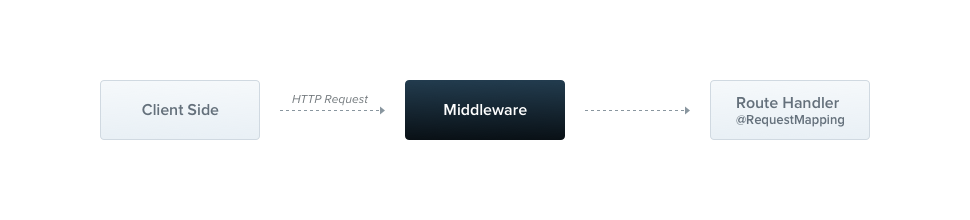

# Middleware

미들웨어(Middleware)란 라우트 핸들러 **이전에** 호출되는 함수를 말한다. 미들웨어 함수는 어플리케이션의 요청-응답 주기에서 `request`와 `response` 객체에 접근할 수 있으며, `next()` 라는 미들웨어 함수를 가진다. **다음** 미들웨어 함수는 일반적으로 `next`라는 변수로 표기된다.



기본적으로 Nest 미들웨어는 **express**의 미들웨어와 동일하다. 다음은 express 공식 문서에서 미들웨어에 대해 설명이다.

> 미들웨어 함수는 다음과 같은 기능들을 수행할 수 있다.
> - 아무 코드나 실행할 수 있다.
> - `request`와 `reponse` 객체를 수정할 수 있다.
> - 요청-응답 주기을 종료시킬 수 있다.
> - 스택에 있는 다음 미들웨어 함수를 호출할 수 있다.
> - 만약 현재 미들웨어 함수가 요청-응답 주기를 끝내지 않으면, `next()`를 호출해 다음 미들웨어 함수로 제어를 넘겨야 한다. 그렇지 않으면 요청이 보류된다.

커스텀 미들웨어는 함수나 클래스에 `@Injectable()` 데코레이터를 붙여 구현할 수 있다. 클래스는 `NestMiddleware` 인터페이스를`implements` 해야 하는데, 함수의 경우에는 따로 특별히 필요한 것이 없다. 클래스를 사용해 간단한 미들웨어를 구현해보자!

```tsx
import { Injectable, NestMiddleware } from '@nestjs/common';
import { Request, Response, NextFunction } from 'express';

@Injectable()
export class LoggerMiddleware implements NestMiddleware {
  use(req: Request, res: Response, next: NextFunction) {
    console.log('Request...');
    next();
  }
}
```

### 의존성 주입(Dependency injection)

Nest 미들웨어는 의존성 주입을 완벽하게 지원한다. 프로바이더나 컨트롤러와 같이, 미들웨어는 같은 모듈 안에서 사용할 수 있는 **의존성들을 주입**할 수 있다. 일반적으로, 이는 `constructor`를 통해 행해진다.

### 미들웨어 적용

`@Module()` 데코레이터를 보면 따로 미들웨어에 대해 적을 곳이 없는 것을 알 수 있다. 대신, 미들웨어는 모듈 클래스의 `configure` 메소드를 사용해 설정할 수 있는데 미들웨어를 포함하고 있는 모듈은 `NestModule` 인터페이스를 `implements` 해야 한다. `AppModule`에서 `LoggerMiddleware`를 설정해보자.

```tsx
import { Module, NestModule, MiddlewareConsumer } from '@nestjs/common';
import { LoggerMiddleware } from './common/middleware/logger.middleware';
import { CatsModule } from './cats/cats.module';

@Module({
  imports: [CatsModule],
})
export class AppModule implements NestModule {
  configure(consumer: MiddlewareConsumer) {
    consumer
      .apply(LoggerMiddleware)
      .forRoutes('cats');
  }
}
```

위 예시에서 `LoggerMiddleware`를 이전에 `CatsController` 안에서 정의한 `/cats` 라우트 핸들러에 대해 설정했다. 또한 더 나아가 미들웨어 설정할 때 라우트 `경로`(예를 들어, `/cats`)와 요청 `메소드`(예를 들어, POST)를 포함하는 객체를 `forRoutes()` 메소드에 전달함으로써 미들웨어를 특정 요청이 올때만 동작하도록 제한할 수 있다. 아래 예시는 특정 메소드 타입을 뜻하는 `RequestMethod` 열거형(Enum)을 가져와 적용했다.

```tsx
import { Module, NestModule, RequestMethod, MiddlewareConsumer } from '@nestjs/common';
import { LoggerMiddleware } from './common/middleware/logger.middleware';
import { CatsModule } from './cats/cats.module';

@Module({
  imports: [CatsModule],
})
export class AppModule implements NestModule {
  configure(consumer: MiddlewareConsumer) {
    consumer
      .apply(LoggerMiddleware)
      .forRoutes({ path: 'cats', method: RequestMethod.GET });
  }
}
```

> **힌트**
> `configure()` 메소드는 `async/await`을 사용해 비동기로 만들 수 있다 (예를 들어, `configre()` 메소드의 바디에서 비동기 연산이 끝나는 것을 `await` 할 수 있다.)

### 라우트 와일드카드(Route wildcards)

패턴 기반 라우트 또한 지원한다. 예를 들어, 애스터리스크(*)는 **와일드카드**로 사용되는데 여기에는 어떤 문자 조합이나 올 수 있다:

```tsx
forRoutes({ path: 'ab*cd', method: RequestMethod.ALL });
```

> **주의**
> `fastify` 패키지는 최신 버젼의 `path-to-regexp` 패키지를 사용하는데 이는 와일드카드 애스터리스크 `*`를 지원하지 않는다. 대신, `(.*)`나 `:splat*`을 사용해야 한다.

### 미들웨어 소비자(Middleware consumer)

`MiddlewareConsumer`는 헬퍼 클래스이다. 이는 미들웨어를 관리하는 여러가지 내장 메소드를 제공한다. 이들 모두는 간단하게 Fluent 스타일로 **연결(Chaining)** 될 수 있다. `forRoutes()` 메소드에는 단일 문자열, 다중 문자열, `RouteInfo` 객체, 컨트롤러 클래스 또는 여러개의 컨트롤러 클래스들을 전달할 수 있다. 대부분의 경우에는 아마 콤마로 구분된 컨트롤러 리스트 하나를 전달할 것이다. 아래 예시는 하나의 컨트롤러를 전달한 경우다.

```tsx
import { Module, NestModule, MiddlewareConsumer } from '@nestjs/common';
import { LoggerMiddleware } from './common/middleware/logger.middleware';
import { CatsModule } from './cats/cats.module';
import { CatsController } from './cats/cats.controller';

@Module({
  imports: [CatsModule],
})
export class AppModule implements NestModule {
  configure(consumer: MiddlewareConsumer) {
    consumer
      .apply(LoggerMiddleware)
      .forRoutes(CatsController);
  }
}
```

> **힌트**
> `apply()` 메소드는 단일 미들웨어를 사용하거나 여러개의 인수를 사용해 여러개의 미들웨어를 지정할 수 있다. 

### 경로 제외(Excluding routes)

때로는 미들웨어를 적용되는 특정 라우트를 **제외**하고 싶을 때도 있다. 이때 `exclude()` 메소드를 사용하면 쉽게 특정 라우트를 제거할 수 있다. 이 메소드는 아래와 같이 단일 문자열, 다중 문자열, 또는 제거할 라우트를 의미하는 `RouteInfo` 객체를 전달 받을 수 있다.

```tsx
consumer
  .apply(LoggerMiddleware)
  .exclude(
    { path: 'cats', method: RequestMethod.GET },
    { path: 'cats', method: RequestMethod.POST },
    'cats/(.*)',
  )
  .forRoutes(CatsController);
```

> **힌트**
> `exclude()` 메소드는 `path-to-regexp` 패키지를 사용해 와일드카드 인자를 지원한다.

위 예시에서 `LoggerMiddleware`는 `CatsController`에서 정의된 모든 라우트들 중 `exclude()` 메소드가 전달받은 세 개를 제외하고 바운딩된다.

### 함수 미들웨어 (Functional middleware)

여태까지 구현한 `LoggerMiddleware` 클래스는 꽤 단순하다. 추가적인 멤버나 메소드, 의존성이 따로 없다. 그렇다면 그냥 이를 함수로 정의해버리는 것은 어떨까? 이러한 종류의 미들웨어를 **함수 미들웨어**라고 한다. 차이를 알아보기 위해 이 미들웨어를 클래스 기반에서 함수 미들웨어로 바꾸어 보자.

```tsx
import { Request, Response, NextFunction } from 'express';

export function logger(req: Request, res: Response, next: NextFunction) {
  console.log(`Request...`);
  next();
};
```

그리고 `AppModule에서 사용해보자.

```tsx
consumer
  .apply(logger)
  .forRoutes(CatsController);
```

> **힌트**
> 미들웨어가 의존성이 없다면 대안으로 간단한 **함수 미들웨어**를 사용해보는 것을 고려해봐라.

### 다중 미들웨어(Multiple middleware)

언급한 바와 같이, 순차적으로 실행되는 다중 미들웨어를 바인딩 하기 위해선 단순히 콤바로 구분된 리스트를 `apply()` 메소드 안에 적으면 된다.

```tsx
consumer.apply(cors(), helmet(), logger).forRoutes(CatsController);
```

### 전역 미들웨어(Global middleware)

미들웨어를 모든 등록된 라우트에 한 번에 바인딩 하고 싶다면, `INestApplication` 객체가 제공하는 `use()` 메소드를 사용할 수 있다.

```tsx
const app = await NestFactory.create(AppModule);
app.use(logger);
await app.listen(3000);
```

> **힌트**
> 전역 미들웨어에서 의존성 주입 컨테이너에 접근하는 것을 불가능하다. `app.use()`를 사용할 때는 대신 **함수 미들웨어**를 사용해라. 클래스 미들웨어를 계속 사용하고 싶다면 `AppModule` (또는 다른 어떠한 모듈) 안에서 `.forRoutes('*')`를 해라.